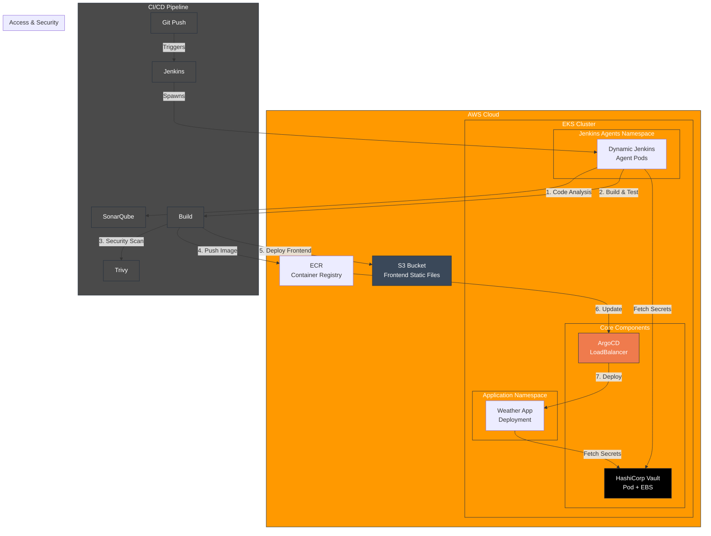
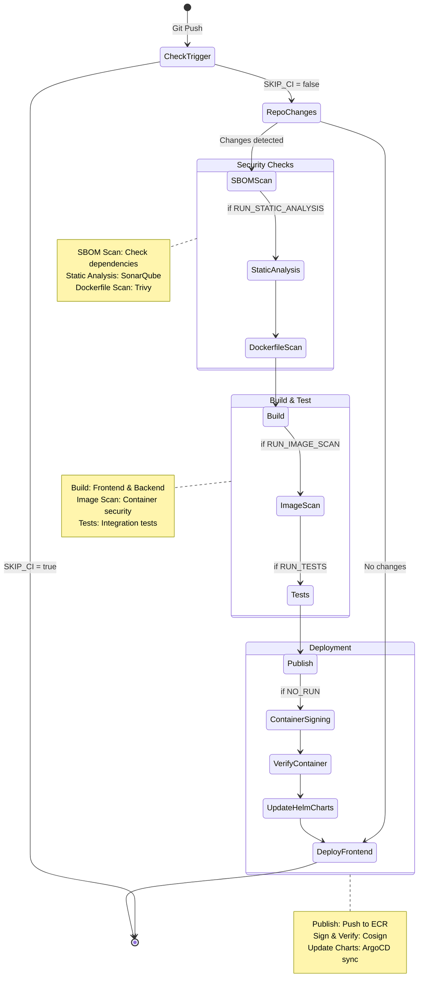
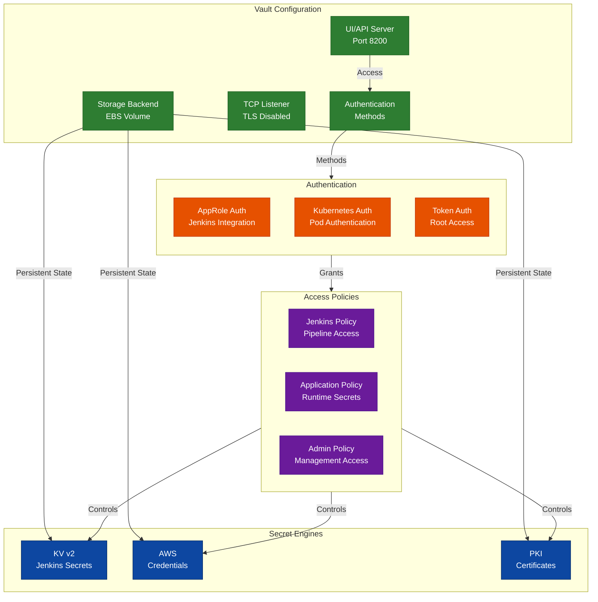
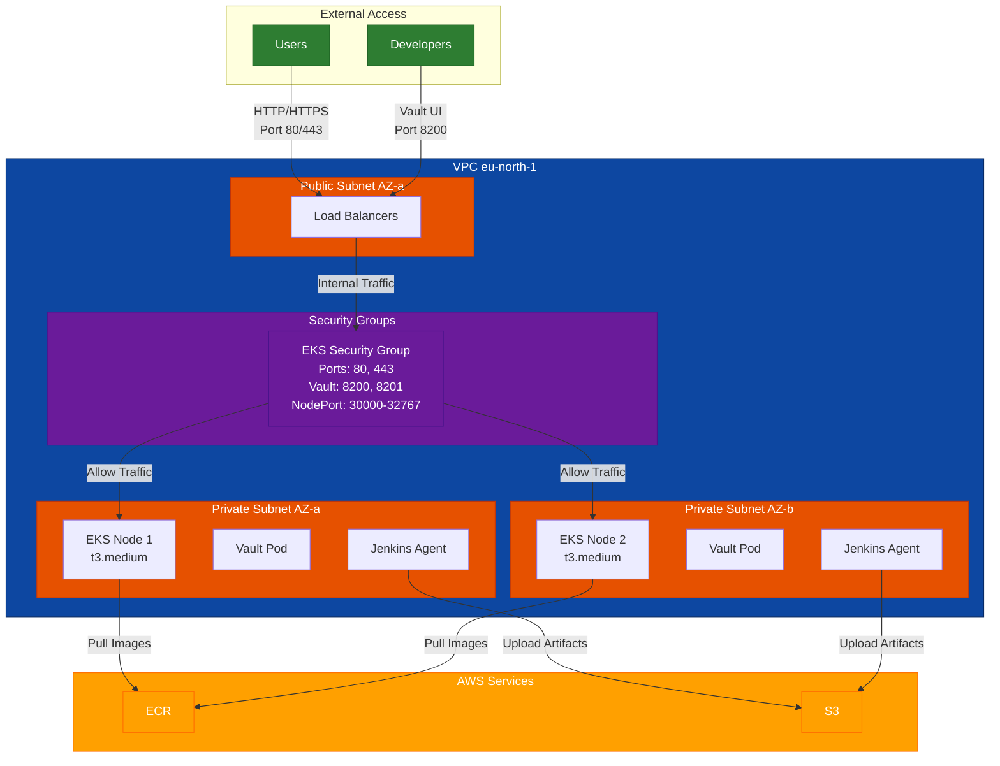

# Weather App with EKS Infrastructure

A comprehensive Weather Application featuring a complete CI/CD pipeline, infrastructure as code, and secure secret management.

## 📑 Index
1. [Project Overview](#-project-overview)
2. [Technologies Used](#-technologies-used)
3. [Features](#-features)
4. [Prerequisites](#-prerequisites)
5. [Initial Setup Guide](#-initial-setup-guide)
6. [Pipeline Configuration](#-pipeline-configuration)
7. [Maintenance and Monitoring](#-maintenance-and-monitoring)
9. [Architecture Diagrams](#-architecture-diagrams)

## 🛠 Technologies Used
- **Cloud Platform**: AWS (EKS, ECR, S3, EBS)
- **Container Runtime**: Docker
- **Container Orchestration**: Kubernetes (EKS v1.32)
- **Infrastructure as Code**: Terraform
- **Secret Management**: HashiCorp Vault (v0.27.0)
- **CI/CD**:
  - Jenkins
  - ArgoCD (v5.46.7)
  - GitOps workflow
- **Security Tools**:
  - Trivy (Container scanning)
  - Cosign (Container signing)
  - SonarQube (Static analysis)
- **Frontend**: React
- **Backend**: Python
- **Monitoring**: AWS CloudWatch
- **Version Control**: Git
- **Configuration Management**: Helm


## 📌 Project Overview

This project consists of two main components:
1. A Python-based Weather Application with React frontend
2. Infrastructure as Code (IaC) for EKS deployment with complete CI/CD pipeline

The solution includes infrastructure as code with Terraform, secure secret management with HashiCorp Vault, and dynamic Jenkins agents running on EKS.

## ✨ Features

### Application Features
- Automated build and test pipeline
- Static code analysis integration
- Artifact publishing to ECR
- Dockerized deployment
- Slack notifications for pipeline status
- Frontend deployed to S3
- Backend deployed to EKS

### Infrastructure Features
- EKS Cluster (v1.32) with managed node groups
  - Dynamic node scaling (1-3 nodes) using t3.medium instances
  - Multi-AZ deployment across eu-north-1 subnets
  - Custom security groups for service access
  - EBS CSI Driver integration for persistent storage
  - Comprehensive IAM roles and policies
- HashiCorp Vault Integration
  - Vault server running in EKS cluster (version 0.27.0)
  - Dedicated vault namespace with its own service account
  - Persistent storage using 10GB GP3 EBS volume with node affinity
  - LoadBalancer service for UI/API access (port 8200)
  - Internal cluster endpoint for service access
  - File storage backend with EBS persistence
- ArgoCD Integration (version 5.46.7)
  - LoadBalancer service type for external access
  - Automated deployment tracking

## 📋 Prerequisites

- AWS CLI configured with appropriate permissions
- Terraform >= 1.0.0
- kubectl
- helm
- Docker
- Access to AWS services:
  - EKS
  - ECR
  - S3
  - EBS
- Jenkins with required plugins:
  - Docker
  - Amazon EC2
  - SSH Agent
  - Slack
  - Kubernetes
- Slack workspace (for notifications)

## 🚀 Initial Setup Guide

### 1. Fork and Clone Repositories
```bash
# Clone the application repository
git clone <your-app-repo-fork-url>

# Clone the infrastructure repository
git clone <your-iac-repo-fork-url>
```

### 2. Configure Infrastructure Variables

Create a `terraform.tfvars` file in the infrastructure repository:

```hcl
# AWS Configuration
aws_region = "your-aws-region"
vpc_id     = "your-vpc-id"
subnet_ids = ["subnet-1", "subnet-2"]

# EKS Configuration
cluster_name    = "your-cluster-name"
instance_types  = ["t3.medium"]  # Adjust based on your needs
node_group_name = "your-node-group"

# Storage Configuration
ebs_volume_size = 10  # GB for Vault storage
```

### 3. Deploy Infrastructure

```bash
cd weathereks_iac/Terraform
terraform init
terraform plan
terraform apply
```

### 4. Configure Jenkins

1. Access Jenkins server
2. Configure Kubernetes Cloud:
   ```yaml
   Name: eks-agents
   Kubernetes URL: <EKS_CLUSTER_ENDPOINT>
   Kubernetes Namespace: jenkins-agents
   Credentials: <JENKINS_AGENT_TOKEN>
   ```

3. Configure Jenkins Credentials:
   - Create 'vault-token' credential for HashiCorp Vault
   - Create AWS credentials for ECR access
   - Create Slack token for notifications
   - Add GitHub/GitLab tokens

### 5. Configure Vault

Initialize and configure Vault after deployment:

```bash
# Initialize Vault
kubectl exec -n vault vault-0 -- vault operator init

# Store the output safely - you'll need the unseal keys and root token

# Configure AppRole for Jenkins
vault auth enable approle
vault write auth/approle/role/jenkins \
    secret_id_ttl=10m \
    token_num_uses=10 \
    token_ttl=20m \
    token_max_ttl=30m \
    secret_id_num_uses=40

# Create KV secrets engine
vault secrets enable -path=secret kv-v2

# Add required secrets matching Jenkinsfile configuration
vault kv put secret/jenkins \
    aws_account_id="<your-aws-account-id>" \
    sonar_token="<your-sonar-token>" \
    dockerhub_username="<your-dockerhub-username>" \
    dockerhub_password="<your-dockerhub-password>" \
    github_token="<your-github-token>" \
    slack_token="<your-slack-token>" \
    aws_access_key="<your-aws-access-key>" \
    aws_secret_key="<your-aws-secret-key>" \
    sonar_project_key="<your-sonar-project-key>" \
    sonar_project_name="<your-sonar-project-name>" \
    ecr_repo_name="<your-ecr-repo>" \
    aws_region="<your-aws-region>" \
    eks_cluster_name="<your-eks-cluster>" \
    s3_front_bucket="<your-frontend-bucket>" \
    s3_reports_bucket="<your-reports-bucket>" \
    helm_charts_repo="<your-helm-repo>"
```

### 6. Configure Jenkins Pipeline

```groovy
@Library('weather-pipeline-lib') _

weatherPipeline([
    vaultUrl: "http://vault.vault.svc.cluster.local:8200",
    vaultCredentialId: "vault-token",
    vaultSecretPaths: [
        [
            path: "secret/jenkins",
            vars: [
                [envVar: "awsAccountId", vaultKey: "aws_account_id"],
                [envVar: "sonarToken", vaultKey: "sonar_token"],
                [envVar: "dockerhubUser", vaultKey: "dockerhub_username"],
                [envVar: "dockerhubPassword", vaultKey: "dockerhub_password"],
                [envVar: "githubToken", vaultKey: "github_token"],
                [envVar: "slackToken", vaultKey: "slack_token"],
                [envVar: "awsAccessKey", vaultKey: "aws_access_key"],
                [envVar: "awsSecretKey", vaultKey: "aws_secret_key"],
                [envVar: "sonarProjectKey", vaultKey: "sonar_project_key"],
                [envVar: "sonarProjectName", vaultKey: "sonar_project_name"],
                [envVar: "ecrRepoName", vaultKey: "ecr_repo_name"],
                [envVar: "awsRegion", vaultKey: "aws_region"],
                [envVar: "eksClusterName", vaultKey: "eks_cluster_name"],
                [envVar: "s3Front", vaultKey: "s3_front_bucket"],
                [envVar: "s3Reports", vaultKey: "s3_reports_bucket"],
                [envVar: "helmChartsRepo", vaultKey: "helm_charts_repo"]
            ]
        ]
    ]
])
```

1. Configure Jenkins Credentials:
   - Create a credential with ID `vault-token` containing your Vault root token or AppRole token
   - Ensure Jenkins has access to the shared library 'weather-pipeline-lib'

2. Verify Vault Connection:
   - The vault URL `http://vault.vault.svc.cluster.local:8200` should be accessible from Jenkins
   - Test the connection using the Jenkins Vault plugin configuration page

3. Configure Environment Variables:
   All environment variables will be automatically loaded from Vault using the mapping defined in the Jenkinsfile. No additional environment variable configuration is needed in Jenkins.

## 📦 Pipeline Configuration

### Shared Library Structure

The pipeline uses a shared library with the following structure:

```groovy
// vars/weatherPipeline.groovy
def call(Map config = [:]) {
    pipeline {
        agent {
            kubernetes {
                label 'eks-agent'
            }
        }

        environment {
            TAG = "${env.BRANCH_NAME == 'master' ? env.BUILD_TAG : env.GIT_COMMIT}"
            SKIP_CI = 'false'
        }

        parameters {
            booleanParam(name: 'RUN_STATIC_ANALYSIS', defaultValue: false, description: 'Run SonarQube static analysis')
            booleanParam(name: 'RUN_TESTS', defaultValue: false, description: 'Run Tests')
            booleanParam(name: 'RUN_IMAGE_SCAN', defaultValue: false, description: 'Run Image scan')
        }

        stages {
            // Pipeline stages defined in separate files
            stage('Check Build Trigger') {
                steps { script { checkBuildTrigger() } }
            }
            // ... other stages
        }
    }
}
```

### Pipeline Parameters

The pipeline includes several toggleable features:
- `RUN_STATIC_ANALYSIS`: Enable SonarQube analysis
- `RUN_TESTS`: Run integration tests
- `RUN_IMAGE_SCAN`: Perform container security scanning

### Stage Details

1. **Check Build Trigger**
   - Checks commit message for `[skip ci]`
   - Determines if build should proceed

2. **Check Repository Changes**
   - Compares current state with previous
   - Optimizes build runs

3. **SBOM Scan**
   ```bash
   # Scans frontend and backend for vulnerabilities
   trivy fs --severity CRITICAL ./backend
   trivy fs --severity CRITICAL ./weather-ui
   ```

4. **Static Analysis** (Optional)
   - Runs SonarQube analysis
   - Waits for quality gate

5. **Dockerfile Scan**
   ```bash
   # Scans Dockerfile for security issues
   trivy config ./backend/dockerfile
   ```

6. **Build**
   - Builds frontend and backend
   - Creates Docker images

7. **Container Image Scanning**
   ```bash
   # Scans container image
   trivy image backend:${TAG}
   ```

8. **Tests**
   - Runs integration tests using docker-compose

9. **Publish**
   - Pushes images to ECR
   - Updates version tags

10. **Container Signing**
    ```bash
    # Signs container with Cosign
    cosign sign --key ${COSIGN_KEY} ${IMAGE_NAME}
    ```

11. **Update Helm Charts**
    - Updates deployment configurations
    - Triggers ArgoCD sync

12. **Deploy Frontend**
    - Deploys static files to S3

## 🔧 Maintenance and Monitoring

### Health Checks
```bash
# Check EKS nodes
kubectl get nodes

# Check Vault status
kubectl exec -n vault vault-0 -- vault status

# Check ArgoCD applications
kubectl get applications -n argocd
```

### Log Access
```bash
# Jenkins agent logs
kubectl logs -n jenkins-agents <pod-name>

# Vault logs
kubectl logs -n vault vault-0

# Application logs
kubectl logs -n <app-namespace> <pod-name>
```


## 🎨 Architecture Diagrams

### Infrastructure Architecture

The following diagram illustrates the overall architecture of the system, including the infrastructure components and CI/CD pipeline:



### GitOps Workflow

The following diagram shows the detailed GitOps workflow with ArgoCD:

```mermaid
graph LR
    subgraph Developer["Developer Workflow"]
        GitCode["Application Code<br>Repository"]
        GitIaC["Infrastructure Code<br>Repository"]
    end

    subgraph Pipeline["Jenkins Pipeline"]
        direction TB
        Build["Build & Test"]
        Scan["Security Scan"]
        Push["Push Container"]
        UpdateChart["Update Helm Charts"]
    end

    subgraph GitOps["GitOps with ArgoCD"]
        direction TB
        HelmRepo["Helm Charts<br>Repository"]
        ArgoCD["ArgoCD<br>Controller"]
        subgraph EKS["EKS Cluster"]
            direction LR
            App["Weather App<br>Pods"]
            Config["ConfigMaps &<br>Secrets"]
        end
    end

    GitCode -->|"1. Push Changes"|Pipeline
    Pipeline -->|"2. Build Image"|Build
    Build -->|"3. Scan"|Scan
    Scan -->|"4. Push to ECR"|Push
    Push -->|"5. Update Version"|UpdateChart
    UpdateChart -->|"6. Commit Changes"|HelmRepo
    GitIaC -->|"Infrastructure Updates"|HelmRepo
    HelmRepo -->|"7. Detect Changes"|ArgoCD
    ArgoCD -->|"8. Apply Changes"|EKS
    ArgoCD -->|"9. Sync Status"|HelmRepo

    classDef dev fill:#2E7D32,stroke:#1B5E20,color:white;
    classDef pipe fill:#0D47A1,stroke:#072B66,color:white;
    classDef gitops fill:#E65100,stroke:#BF360C,color:white;
    classDef eks fill:#00838F,stroke:#006064,color:white;

    class GitCode,GitIaC dev;
    class Build,Scan,Push,UpdateChart pipe;
    class HelmRepo,ArgoCD gitops;
    class EKS,App,Config eks;
```



## 🔄 Pipeline Stages

The following diagram details the Jenkins pipeline stages and their conditions:



## 🔒 Vault Configuration

The following diagram shows the Vault configuration and secret management setup:



## 🌐 Network Flow

The following diagram illustrates the network flow and security group configuration:

